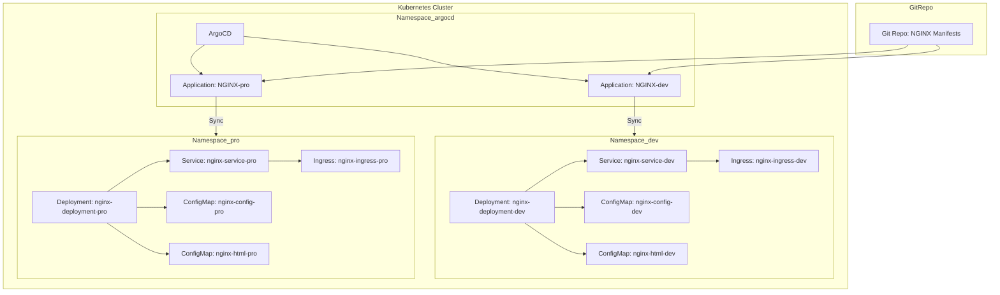

# Kubernetes and ArgoCD Setup Guide on Windows

This guide provides step-by-step instructions to install and configure Kubernetes and ArgoCD on Windows using Minikube.

---

# Architecture Diagram



---

## 1. Install Windows Package Manager (winget)

First, download and install the Windows Package Manager (winget) from the Microsoft Store:

[Download Windows Package Manager](https://apps.microsoft.com/detail/9nblggh4nns1?rtc=1&hl=es-es&gl=ES#activetab=pivot:overviewtab)

---

## 2. Install kubectl CLI

You can install `kubectl`, the Kubernetes command-line tool, via the official Kubernetes documentation or using `winget`:

### Official Docs:
[Install kubectl on Windows](https://kubernetes.io/docs/tasks/tools/install-kubectl-windows/)

### Using winget:
```bash
winget install -e --id Kubernetes.kubectl
kubectl version --client
```

> **Note:** If you encounter any errors, ensure that the kubectl binary is added to your PATH in the system environment variables.

---

## 3. Install Minikube

To install Minikube, the tool to run Kubernetes locally, use the following command or visit the official documentation:

### Official Docs:
[Install Minikube on Windows](https://minikube.sigs.k8s.io/docs/start/?arch=%2Fwindows%2Fx86-64%2Fstable%2Fwindows+package+manager)

### Using winget:
```bash
winget install Kubernetes.minikube
```

> **Note:** If Minikube isn't running correctly, ensure the Minikube binary is also in your PATH.

To enable `Ingress` in Minikube:
```bash
minikube start
minikube addons enable ingress
```

---

## 4. Install ArgoCD on Minikube

Once Minikube is up and running, follow these steps to install ArgoCD in your Kubernetes cluster:

1. Create a new namespace for ArgoCD:
    ```bash
    kubectl create namespace argocd
    ```

2. Apply the ArgoCD installation manifest:
    ```bash
    kubectl apply -n argocd -f https://raw.githubusercontent.com/argoproj/argo-cd/stable/manifests/install.yaml
    ```

---

## 5. Retrieve ArgoCD Initial Admin Password

To retrieve the initial admin password for ArgoCD, use the following PowerShell script:

```bash
$base64Encoded = kubectl -n argocd get secret argocd-initial-admin-secret -o jsonpath="{.data.password}"
[System.Text.Encoding]::UTF8.GetString([System.Convert]::FromBase64String($base64Encoded))
```

---

## 6. Access the ArgoCD Dashboard

To access the ArgoCD dashboard, set up port-forwarding from your local machine to the ArgoCD server:

```bash
kubectl port-forward svc/argocd-server -n argocd 8080:443
```

Once the port-forwarding is active, open your browser and visit:

[https://localhost:8080](https://localhost:8080)

Use the username `admin` and the password retrieved in the previous step.

---

## 7. Get NGINX Service URL

To retrieve the URL for your NGINX service, run:

```bash
minikube service nginx-service --url -n dev
minikube service nginx-service --url -n pro
```

---

## 8. Add Host Entries for NGINX Services

Add the NGINX service IP addresses to your system's `hosts` file for easy access:

```bash
Add-Content -Path $env:windir\System32\drivers\etc\hosts -Value "`n$(minikube ip) dev.nginx.test" -Force
Add-Content -Path $env:windir\System32\drivers\etc\hosts -Value "`n$(minikube ip) pro.nginx.test" -Force
```

---

## 9. Access NGINX Services

After adding the entries to your `hosts` file, you can access the NGINX services in your browser at the following URLs:

- [http://dev.nginx.test/](http://dev.nginx.test/)
- [http://pro.nginx.test/](http://pro.nginx.test/)

## 10. Delete resources

```bash
minikube delete
```